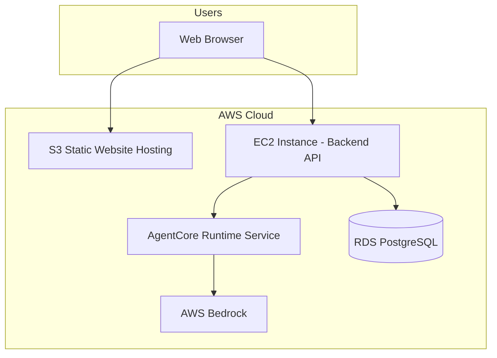

# Design Document

## Overview

This design outlines a simplified migration of the fitness agent application to AWS. The focus is on deploying the core components (frontend, backend, database) to AWS and migrating the agent functionality from Strands to AgentCore. This approach prioritizes getting the application running in the cloud with minimal complexity.

## Architecture

### Simplified Architecture



### Component Architecture

1. **Frontend (React/Vite)**
   - Built static files deployed to S3 bucket
   - S3 configured for static website hosting
   - Public access for web serving

2. **Backend API (FastAPI)**
   - Deployed on single EC2 instance
   - Docker container running the FastAPI application
   - Direct integration with AgentCore library

3. **Agent Service (AgentCore Runtime)**
   - AgentCore Runtime deployed as separate Docker container
   - Runs alongside FastAPI backend on same EC2 instance
   - Replaces current Strands-based implementation
   - Communicates with FastAPI via HTTP API calls

4. **Database (PostgreSQL)**
   - RDS PostgreSQL instance (single AZ for simplicity)
   - Migrated from local Docker PostgreSQL
   - Basic automated backups enabled

## Components and Interfaces

### AgentCore Integration

**Current Implementation (Strands):**
```python
from strands import Agent
from strands.models.bedrock import BedrockModel

class FitnessAgent:
    def __init__(self):
        self.model = BedrockModel(model_id=self.model_id)
        self.agent = Agent(model=self.model, tools=self.tools)
```

**New Implementation (AgentCore Runtime):**
```python
import requests
import os

class FitnessAgentCore:
    def __init__(self):
        self.agentcore_url = os.getenv('AGENTCORE_URL', 'http://localhost:8080')
    
    def generate_fitness_plan(self, user_profile: dict) -> dict:
        # Step 1: Planning request to AgentCore
        planning_response = requests.post(
            f"{self.agentcore_url}/agents/fitness-planner/invoke",
            json={
                "prompt": self._build_planning_prompt(user_profile),
                "tools": ["health_calculations", "workout_generator", "meal_planner"]
            }
        )
        
        # Step 2: Structure the response
        structure_response = requests.post(
            f"{self.agentcore_url}/agents/fitness-planner/invoke",
            json={
                "prompt": self._build_structure_prompt(planning_response.json()),
                "response_format": "structured"
            }
        )
        
        return structure_response.json()
```

### Service Interfaces

**1. Frontend ↔ Backend API**
- Existing REST API endpoints maintained
- Authentication via JWT tokens  
- CORS configuration updated for S3 website URL

**2. Backend API ↔ AgentCore Runtime**
- FastAPI backend communicates with AgentCore Runtime via HTTP
- AgentCore Runtime runs on localhost:8080 (same EC2 instance)
- Existing agent API endpoints maintained with internal HTTP calls
- Docker Compose orchestrates both services

**3. AgentCore Runtime ↔ AWS Bedrock**
- AgentCore Runtime configured with AWS Bedrock models
- Uses EC2 instance IAM role for AWS authentication
- Same model IDs and prompts as current implementation
- AgentCore handles all LLM interactions and tool orchestration

### Infrastructure Components

**1. Compute**
- Single EC2 instance (t3.medium or similar)
- Docker and Docker Compose installed
- Two containers: FastAPI backend + AgentCore Runtime
- Elastic IP for consistent public access

**2. Storage**
- S3 bucket for frontend static files
- RDS PostgreSQL (db.t3.micro for cost efficiency)
- EBS volume for EC2 instance storage

**3. Networking**
- Default VPC with public subnet
- Security Groups for HTTP/HTTPS and database access
- Simple firewall rules for necessary ports

## Data Models

### Database Migration Strategy

**Current Schema:** Maintained as-is
- Users, UserProfile, FitnessPlan tables
- JSON columns for flexible data storage
- Foreign key relationships preserved

**Migration Approach:**
1. Export existing data from local PostgreSQL
2. Create RDS instance with same schema
3. Import data using AWS DMS or pg_dump/restore
4. Update connection strings in application

### AgentCore Runtime Configuration

**Agent Definition (agentcore-config.yaml):**
```yaml
agents:
  fitness-planner:
    model:
      provider: bedrock
      model_id: anthropic.claude-3-sonnet-20240229-v1:0
      temperature: 0.7
      max_tokens: 4000
    tools:
      - name: health_calculations
        description: Calculate BMI, BMR, and calorie needs
      - name: workout_generator
        description: Generate workout routines
      - name: meal_planner
        description: Create meal plans
    system_prompt: |
      You are a fitness and nutrition expert...
```

**Docker Compose Setup:**
```yaml
version: '3.8'
services:
  backend:
    build: ./backend
    ports:
      - "8000:8000"
    environment:
      - AGENTCORE_URL=http://agentcore:8080
      - DATABASE_URL=postgresql://...
  
  agentcore:
    image: agentcore/runtime:latest
    ports:
      - "8080:8080"
    volumes:
      - ./agentcore-config.yaml:/config/agents.yaml
    environment:
      - AWS_REGION=us-east-1
```

## Error Handling

### Application-Level Error Handling

**1. AgentCore Runtime Failures**
- Basic retry logic for HTTP requests to AgentCore
- Fallback error responses when AgentCore is unavailable
- Health check endpoint for AgentCore service

**2. Database Connection Issues**
- Basic connection retry logic
- Transaction rollback on errors
- Error logging for debugging

**3. AWS Service Failures**
- Basic error handling for Bedrock API calls
- Graceful degradation when services are unavailable

## Testing Strategy

### Basic Testing Approach
- Maintain existing unit tests for business logic
- Add integration tests for AgentCore HTTP communication
- Test database migration process
- Manual testing of deployed application

### Security Considerations

**1. Basic Security**
- Security Groups allowing only necessary ports (80, 443, 5432)
- IAM role for EC2 instance to access Bedrock and RDS
- Environment variables for sensitive configuration

**2. Data Protection**
- RDS encryption at rest (default)
- HTTPS for frontend (S3 website with custom domain optional)