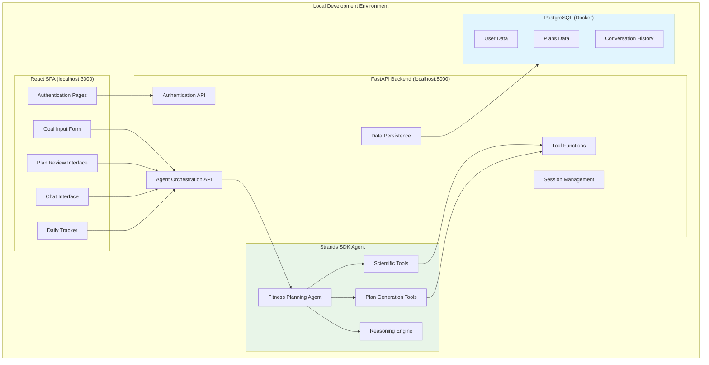
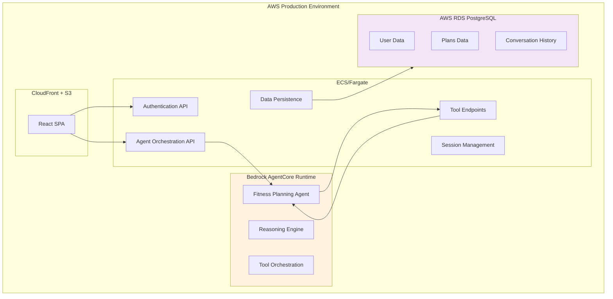
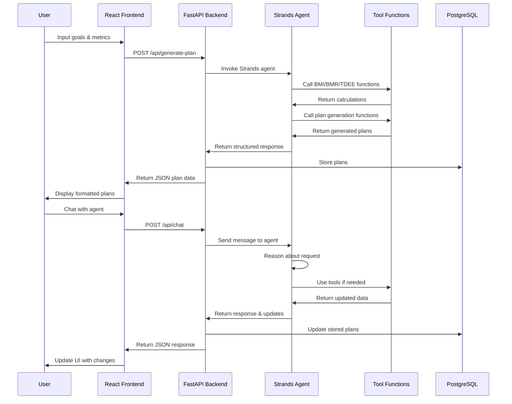
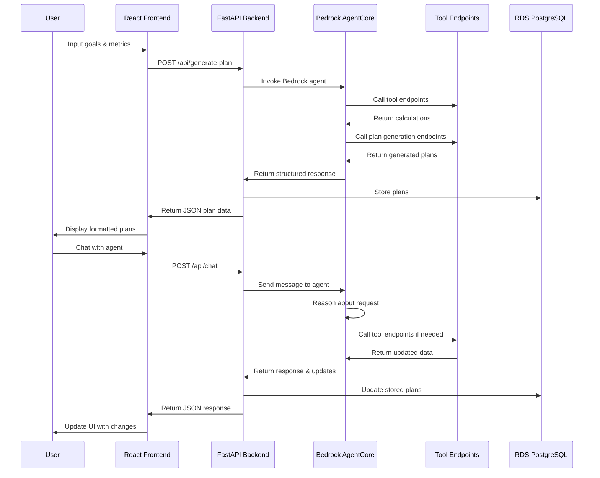
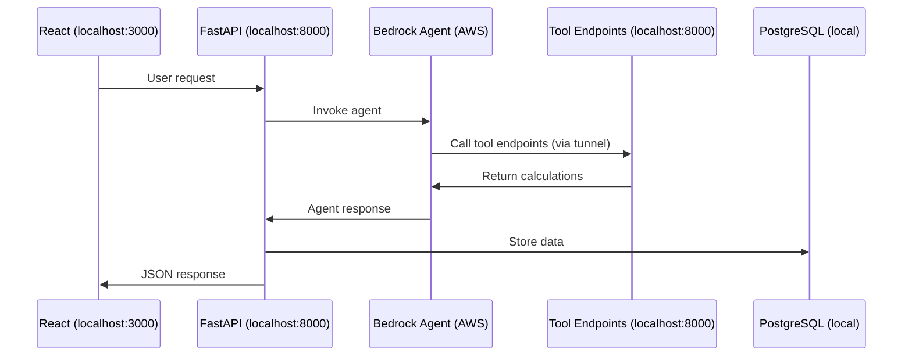

# Design Document

## Overview

The FitnessAgent Website is a JavaScript React single-page application with a FastAPI backend that integrates with AI agents for truly agentic fitness and nutrition planning. The system uses a dual-phase development approach: **Strands SDK for local development** and **AWS Bedrock AgentCore Runtime for production deployment**.

During development, the AI agent runs locally using Strands SDK, allowing for rapid iteration, debugging, and testing. For production, the same agent logic is deployed to AWS Bedrock AgentCore Runtime for scalability and managed infrastructure.

The architecture follows a clear separation between the FastAPI backend (orchestrating agent interactions and data persistence) and the React frontend (providing user interface). The AI agent has access to scientific calculation tools (BMI, BMR, TDEE) and uses structured reasoning to create and modify plans autonomously. The FastAPI backend serves as the orchestration layer between the React frontend and the AI agent (Strands locally, Bedrock AgentCore in production).

## Architecture

### Development Architecture (Strands SDK)



### Production Architecture (Bedrock AgentCore Runtime)



### Development Data Flow (Strands SDK)



### Production Data Flow (Bedrock AgentCore)



## Components and Interfaces

### Frontend Components

#### 1. Authentication System
- **LoginPage**: Handles user authentication with form validation
- **SignUpPage**: User registration with input validation
- **AuthProvider**: Context provider for authentication state management

#### 2. Goal Input System
- **GoalInputForm**: Multi-step form for collecting user preferences
  - Fitness goals selection (lose weight, gain muscle, maintain, recomp)
  - Physical metrics input (weight, height with BMI preview)
  - Equipment availability checklist
  - Workout preferences (duration, frequency)
- **FormValidation**: Client-side validation with real-time feedback

#### 3. Plan Display System
- **WeeklyWorkoutView**: Calendar-style workout plan display
  - Day cards with workout type labels
  - Click-to-expand detailed workout view
- **MealPlanDisplay**: Structured meal plan presentation
  - Daily meal breakdown with macros
  - Ingredient lists and preparation instructions
- **PlanSummary**: Overview of caloric targets and macro distribution

#### 4. Conversational Interface
- **ChatInterface**: Real-time conversation with the AI agent
  - Message history with context preservation
  - Typing indicators and response streaming
  - Plan update notifications
- **PlanRefinementPanel**: Quick action buttons for common requests
  - Meal substitutions, workout modifications, schedule changes

#### 5. Daily Tracker System
- **WeeklyCalendar**: Interactive weekly view with workout labels
- **DailyWorkoutDetail**: Expandable workout details for selected days
- **DailyNutritionPanel**: Meal plan display with macro tracking
- **ProgressNavigation**: Easy navigation back to plan modification

### Backend Agent Interfaces

#### 1. FastAPI Response Formats

The FastAPI backend returns structured JSON data for React consumption:

```javascript
// Workout Plan JSON Format
const workoutPlanExample = {
  weeklySchedule: {
    "monday": {
      workoutType: "push",
      label: "Push Day - Chest, Shoulders, Triceps",
      duration: 45,
      exercises: [
        {
          name: "Push-ups",
          sets: 3,
          reps: "8-12",
          weight: "bodyweight",
          restTime: "60 seconds",
          instructions: "Keep core tight, full range of motion",
          targetMuscles: ["chest", "shoulders", "triceps"]
        }
      ]
    },
    // ... other days
  },
  totalWeeklyVolume: 180,
  progressionNotes: "Increase reps when you can complete all sets"
};

// Meal Plan JSON Format
const mealPlanExample = {
  dailyCalories: 2200,
  macros: {
    protein: 165,
    carbs: 220,
    fat: 73
  },
  meals: {
    "breakfast": {
      name: "Protein Oatmeal Bowl",
      calories: 450,
      macros: { protein: 25, carbs: 55, fat: 12 },
      ingredients: [
        {
          name: "Rolled oats",
          amount: "1",
          unit: "cup",
          calories: 300,
          macros: { protein: 10, carbs: 54, fat: 6 }
        }
      ],
      instructions: "Cook oats with water, add protein powder when cool",
      prepTime: 10
    }
    // ... other meals
  }
};
```

#### 2. FastAPI Tool Endpoints for Bedrock Agent

The AI agent calls FastAPI endpoints as tools during reasoning. These endpoints are registered as Action Groups in Bedrock Agent:

```python
# FastAPI Tool Endpoints (registered as Bedrock Action Groups)
@app.post("/tools/calculate-bmi")
async def calculate_bmi_tool(request: BMIRequest):
    """Calculate Body Mass Index - called by Bedrock agent"""
    bmi = request.weight / ((request.height / 100) ** 2)
    return {"bmi": round(bmi, 1), "category": get_bmi_category(bmi)}

@app.post("/tools/calculate-bmr")
async def calculate_bmr_tool(request: BMRRequest):
    """Calculate Basal Metabolic Rate - called by Bedrock agent"""
    if request.gender.lower() == 'male':
        bmr = (10 * request.weight) + (6.25 * request.height) - (5 * request.age) + 5
    else:
        bmr = (10 * request.weight) + (6.25 * request.height) - (5 * request.age) - 161
    return {"bmr": round(bmr)}

@app.post("/tools/calculate-tdee")
async def calculate_tdee_tool(request: TDEERequest):
    """Calculate Total Daily Energy Expenditure - called by Bedrock agent"""
    activity_multipliers = {
        "sedentary": 1.2,
        "lightly_active": 1.375,
        "moderately_active": 1.55,
        "very_active": 1.725,
        "extremely_active": 1.9
    }
    multiplier = activity_multipliers.get(request.activity_level, 1.55)
    tdee = request.bmr * multiplier
    return {"tdee": round(tdee), "activity_multiplier": multiplier}

@app.post("/tools/calculate-macros")
async def calculate_macros_tool(request: MacroRequest):
    """Calculate optimal macro distribution - called by Bedrock agent"""
    if request.goal == 'lose-weight':
        protein = request.body_weight * 2.2  # high protein for muscle preservation
        fat_calories = request.calories * 0.25
        fat = fat_calories / 9
        carb_calories = request.calories - (protein * 4) - fat_calories
        carbs = carb_calories / 4
    elif request.goal == 'gain-muscle':
        protein = request.body_weight * 2.0
        fat_calories = request.calories * 0.30
        fat = fat_calories / 9
        carb_calories = request.calories - (protein * 4) - fat_calories
        carbs = carb_calories / 4
    # ... other goals
    
    return {
        "protein": round(protein),
        "carbs": round(carbs),
        "fat": round(fat),
        "protein_calories": round(protein * 4),
        "carb_calories": round(carbs * 4),
        "fat_calories": round(fat * 9)
    }

@app.post("/tools/generate-workout-plan")
async def generate_workout_plan_tool(request: WorkoutPlanRequest):
    """Generate structured workout plan - called by Bedrock agent"""
    # Workout generation logic based on goals, equipment, frequency
    workout_plan = create_workout_plan(
        goal=request.goal,
        frequency=request.frequency,
        duration=request.duration,
        equipment=request.equipment,
        experience_level=request.experience_level
    )
    return {"workout_plan": workout_plan}

@app.post("/tools/generate-meal-plan")
async def generate_meal_plan_tool(request: MealPlanRequest):
    """Generate meal plan matching targets - called by Bedrock agent"""
    meal_plan = create_meal_plan(
        calories=request.calories,
        macros=request.macros,
        dietary_restrictions=request.dietary_restrictions,
        meal_preferences=request.meal_preferences
    )
    return {"meal_plan": meal_plan}

# Pydantic Models for Tool Requests
class BMIRequest(BaseModel):
    weight: float
    height: float

class BMRRequest(BaseModel):
    weight: float
    height: float
    age: int
    gender: str

class TDEERequest(BaseModel):
    bmr: float
    activity_level: str

class MacroRequest(BaseModel):
    calories: float
    goal: str
    body_weight: float

# Bedrock Agent Action Group Configuration (done in AWS console)
action_group_config = {
    "actionGroupName": "fitness-calculation-tools",
    "description": "Scientific fitness calculation tools",
    "actionGroupExecutor": {
        "customControl": "RETURN_CONTROL"  # Agent calls our FastAPI endpoints
    },
    "apiSchema": {
        "s3": {
            "s3BucketName": "your-bucket",
            "s3ObjectKey": "fitness-tools-openapi.json"  # OpenAPI spec for our tools
        }
    }
}
    {
        "toolSpec": {
            "name": "calculate_bmr",
            "description": "Calculate Basal Metabolic Rate using Mifflin-St Jeor equation",
            "inputSchema": {
                "json": {
                    "type": "object",
                    "properties": {
                        "weight": {"type": "number"},
                        "height": {"type": "number"},
                        "age": {"type": "number"},
                        "gender": {"type": "string", "enum": ["male", "female"]}
                    },
                    "required": ["weight", "height", "age", "gender"]
                }
            }
        }
    },
    {
        "toolSpec": {
            "name": "calculate_tdee",
            "description": "Calculate Total Daily Energy Expenditure",
            "inputSchema": {
                "json": {
                    "type": "object",
                    "properties": {
                        "bmr": {"type": "number"},
                        "activity_level": {"type": "string"},
                        "workout_frequency": {"type": "number"}
                    },
                    "required": ["bmr", "activity_level", "workout_frequency"]
                }
            }
        }
    },
    {
        "toolSpec": {
            "name": "calculate_macros",
            "description": "Calculate optimal macro distribution for fitness goals",
            "inputSchema": {
                "json": {
                    "type": "object",
                    "properties": {
                        "calories": {"type": "number"},
                        "goal": {"type": "string"},
                        "body_weight": {"type": "number"}
                    },
                    "required": ["calories", "goal", "body_weight"]
                }
            }
        }
    },
    {
        "toolSpec": {
            "name": "generate_workout_plan",
            "description": "Generate a structured workout plan based on goals and constraints",
            "inputSchema": {
                "json": {
                    "type": "object",
                    "properties": {
                        "goal": {"type": "string"},
                        "frequency": {"type": "number"},
                        "duration": {"type": "number"},
                        "equipment": {"type": "array"},
                        "experience_level": {"type": "string"}
                    },
                    "required": ["goal", "frequency", "duration", "equipment"]
                }
            }
        }
    },
    {
        "toolSpec": {
            "name": "generate_meal_plan",
            "description": "Generate a meal plan matching caloric and macro targets",
            "inputSchema": {
                "json": {
                    "type": "object",
                    "properties": {
                        "calories": {"type": "number"},
                        "macros": {"type": "object"},
                        "dietary_restrictions": {"type": "array"},
                        "meal_preferences": {"type": "array"}
                    },
                    "required": ["calories", "macros"]
                }
            }
        }
    }
]

# Tool Implementation Functions
def execute_tool(tool_name, parameters):
    """Execute agent tool and return results"""
    if tool_name == "calculate_bmi":
        weight, height = parameters["weight"], parameters["height"]
        bmi = weight / ((height / 100) ** 2)
        return {"bmi": round(bmi, 1)}
    
    elif tool_name == "calculate_bmr":
        weight, height, age, gender = parameters["weight"], parameters["height"], parameters["age"], parameters["gender"]
        if gender.lower() == 'male':
            bmr = (10 * weight) + (6.25 * height) - (5 * age) + 5
        else:
            bmr = (10 * weight) + (6.25 * height) - (5 * age) - 161
        return {"bmr": round(bmr)}
    
    # ... other tool implementations
```

#### 3. Bedrock Agent Runtime Integration

```python
import boto3
from botocore.exceptions import ClientError

class BedrockAgentClient:
    def __init__(self):
        self.bedrock_agent_runtime = boto3.client(
            'bedrock-agent-runtime',
            region_name='us-east-1'  # or your preferred region
        )
        self.agent_id = "YOUR_AGENT_ID"  # from Bedrock console
        self.agent_alias_id = "TSTALIASID"  # or your alias
    
    async def invoke_agent(self, user_input: str, session_id: str, user_context: dict = None):
        """Invoke Bedrock agent with user input and context"""
        try:
            response = self.bedrock_agent_runtime.invoke_agent(
                agentId=self.agent_id,
                agentAliasId=self.agent_alias_id,
                sessionId=session_id,
                inputText=user_input,
                sessionState={
                    'sessionAttributes': user_context or {},
                    'promptSessionAttributes': {}
                }
            )
            
            # Process streaming response
            agent_response = ""
            for event in response['completion']:
                if 'chunk' in event:
                    chunk = event['chunk']
                    if 'bytes' in chunk:
                        agent_response += chunk['bytes'].decode('utf-8')
            
            return {
                "response": agent_response,
                "session_id": session_id,
                "trace": response.get('trace', {})
            }
            
        except ClientError as e:
            raise HTTPException(status_code=500, detail=f"Bedrock agent error: {str(e)}")

# FastAPI Integration
bedrock_client = BedrockAgentClient()

@app.post("/api/generate-plan")
async def generate_plan(request: PlanGenerationRequest):
    """Generate plan using Bedrock agent"""
    user_context = {
        "user_id": request.user_id,
        "goals": request.goals,
        "metrics": request.metrics,
        "preferences": request.preferences
    }
    
    prompt = f"""
    Generate a personalized fitness and meal plan for a user with the following information:
    Goals: {request.goals}
    Metrics: {request.metrics}
    Preferences: {request.preferences}
    
    Please use the available calculation tools to determine BMI, BMR, TDEE, and macro requirements,
    then create appropriate workout and meal plans.
    """
    
    result = await bedrock_client.invoke_agent(
        user_input=prompt,
        session_id=f"plan_generation_{request.user_id}",
        user_context=user_context
    )
    
    return result

@app.post("/api/chat")
async def chat_with_agent(request: ChatRequest):
    """Chat with Bedrock agent for plan refinement"""
    result = await bedrock_client.invoke_agent(
        user_input=request.message,
        session_id=f"chat_{request.user_id}_{request.plan_id}",
        user_context={"plan_id": request.plan_id}
    )
    
    return result
```

### API Contracts

#### 1. Agent Orchestration Endpoints

```python
# Pydantic Models
class PlanGenerationRequest(BaseModel):
    user_id: str
    goals: dict  # fitness goals
    metrics: dict  # weight, height, age, gender
    preferences: dict  # equipment, schedule, dietary

class AgentResponse(BaseModel):
    agent_response: str
    structured_data: Optional[dict] = None  # parsed workout/meal plans
    session_id: str
    calculations_used: Optional[dict] = None  # BMI, BMR, TDEE values

class ChatRequest(BaseModel):
    user_id: str
    message: str
    plan_id: Optional[str] = None
    session_id: str

# FastAPI Endpoints that orchestrate Bedrock Agent
@app.post("/api/generate-plan", response_model=AgentResponse)
async def generate_plan(request: PlanGenerationRequest, db: Session = Depends(get_db)):
    """Orchestrate plan generation through Bedrock agent"""
    # Agent will autonomously use BMI, BMR, TDEE tools during reasoning
    result = await bedrock_client.invoke_agent(
        user_input=create_plan_generation_prompt(request),
        session_id=f"plan_{request.user_id}_{int(time.time())}",
        user_context=request.dict()
    )
    
    # Parse agent response for structured data
    structured_data = parse_agent_response_for_plans(result["response"])
    
    # Store in database
    if structured_data:
        plan = FitnessPlan(
            user_id=request.user_id,
            workout_plan=structured_data.get("workout_plan"),
            meal_plan=structured_data.get("meal_plan")
        )
        db.add(plan)
        db.commit()
    
    return AgentResponse(
        agent_response=result["response"],
        structured_data=structured_data,
        session_id=result["session_id"]
    )

@app.post("/api/chat", response_model=AgentResponse)
async def chat_with_agent(request: ChatRequest, db: Session = Depends(get_db)):
    """Handle conversational plan refinement through Bedrock agent"""
    # Agent will reason about changes and use tools as needed
    result = await bedrock_client.invoke_agent(
        user_input=request.message,
        session_id=request.session_id,
        user_context={"plan_id": request.plan_id} if request.plan_id else {}
    )
    
    # Parse for any plan updates
    plan_updates = parse_agent_response_for_updates(result["response"])
    
    # Update database if plans were modified
    if plan_updates and request.plan_id:
        update_plan_in_database(request.plan_id, plan_updates, db)
    
    return AgentResponse(
        agent_response=result["response"],
        structured_data=plan_updates,
        session_id=result["session_id"]
    )

def create_plan_generation_prompt(request: PlanGenerationRequest) -> str:
    """Create a prompt that guides the agent to use tools autonomously"""
    return f"""
    I need you to create a personalized fitness and meal plan. Here's the user information:
    
    Goals: {request.goals}
    Physical Metrics: {request.metrics}
    Preferences: {request.preferences}
    
    Please follow this process:
    1. Use the BMI calculator to assess the user's current body composition
    2. Use the BMR calculator to determine their baseline metabolic rate
    3. Use the TDEE calculator to find their total daily energy needs
    4. Use the macro calculator to determine optimal protein, carb, and fat targets
    5. Use the workout plan generator to create a suitable exercise routine
    6. Use the meal plan generator to create meals that hit their caloric and macro targets
    
    Provide both a conversational explanation of your reasoning and the structured plan data.
    """
```

## Data Models

### Database Models (SQLAlchemy)

```python
from sqlalchemy import Column, Integer, String, Float, Boolean, DateTime, JSON
from sqlalchemy.ext.declarative import declarative_base

Base = declarative_base()

class User(Base):
    __tablename__ = "users"
    
    id = Column(String, primary_key=True)
    email = Column(String, unique=True, nullable=False)
    password_hash = Column(String, nullable=False)
    created_at = Column(DateTime, default=datetime.utcnow)

class UserProfile(Base):
    __tablename__ = "user_profiles"
    
    id = Column(String, primary_key=True)
    user_id = Column(String, nullable=False)
    age = Column(Integer)
    weight = Column(Float)  # in kg
    height = Column(Float)  # in cm
    gender = Column(String)  # 'male', 'female', 'other'
    fitness_goal = Column(String)  # 'lose-weight', 'gain-muscle', etc.
    available_equipment = Column(JSON)  # list of equipment
    workout_preferences = Column(JSON)  # duration, frequency, etc.
    dietary_restrictions = Column(JSON)  # list of restrictions
    allergies = Column(JSON)  # list of allergies

# JavaScript Frontend Data Structures
const userProfile = {
  age: 25,
  weight: 70,
  height: 175,
  gender: 'male',
  fitnessGoal: 'gain-muscle',
  availableEquipment: ['dumbbells', 'bench', 'resistance-bands'],
  workoutPreferences: {
    duration: 45,
    frequency: 4,
    preferredDays: ['monday', 'tuesday', 'thursday', 'friday'],
    timeOfDay: 'evening'
  },
  dietaryRestrictions: ['vegetarian'],
  allergies: ['nuts']
};
```

### Plan Data Models

```python
class FitnessPlan(Base):
    __tablename__ = "fitness_plans"
    
    id = Column(String, primary_key=True)
    user_id = Column(String, nullable=False)
    workout_plan = Column(JSON)  # complete workout plan
    meal_plan = Column(JSON)     # complete meal plan
    created_at = Column(DateTime, default=datetime.utcnow)
    last_modified = Column(DateTime, default=datetime.utcnow)
    status = Column(String, default='active')  # 'active', 'archived', 'draft'
    version = Column(Integer, default=1)

class ConversationHistory(Base):
    __tablename__ = "conversation_history"
    
    id = Column(String, primary_key=True)
    user_id = Column(String, nullable=False)
    plan_id = Column(String, nullable=False)
    message = Column(String, nullable=False)
    response = Column(String, nullable=False)
    timestamp = Column(DateTime, default=datetime.utcnow)
    plan_changes = Column(JSON)  # any plan modifications made

class PlanChange(Base):
    __tablename__ = "plan_changes"
    
    id = Column(String, primary_key=True)
    plan_id = Column(String, nullable=False)
    change_type = Column(String)  # 'workout', 'meal', 'schedule'
    description = Column(String)
    before_data = Column(JSON)
    after_data = Column(JSON)
    reason = Column(String)
    timestamp = Column(DateTime, default=datetime.utcnow)
```

## Error Handling

### Frontend Error Handling

1. **Form Validation Errors**
   - Real-time validation with user-friendly messages
   - Prevention of invalid data submission
   - Clear indication of required fields and format requirements

2. **API Communication Errors**
   - Network timeout handling with retry mechanisms
   - Graceful degradation when agent is unavailable
   - Loading states and progress indicators

3. **Plan Display Errors**
   - Fallback content when plan data is incomplete
   - Error boundaries to prevent app crashes
   - User-friendly error messages with recovery options

### Backend Agent Error Handling

1. **Calculation Errors**
   - Validation of input parameters before calculations
   - Fallback to default values when calculations fail
   - Clear error messages explaining calculation issues

2. **Plan Generation Failures**
   - Retry mechanisms for failed plan generation
   - Partial plan recovery when possible
   - Alternative plan suggestions when primary generation fails

3. **Conversation Context Errors**
   - Context recovery from stored conversation history
   - Graceful handling of context loss
   - Clear communication when context needs to be rebuilt

## Testing Strategy

### Frontend Testing

1. **Unit Testing**
   - Component testing with React Testing Library
   - Form validation logic testing
   - State management testing with mock data

2. **Integration Testing**
   - API integration testing with mock agent responses
   - User flow testing across multiple components
   - Authentication flow testing

3. **E2E Testing**
   - Complete user journey testing from signup to plan consumption
   - Cross-browser compatibility testing
   - Mobile responsiveness testing

### Backend Agent Testing

1. **Tool Testing**
   - Scientific calculation accuracy testing
   - Edge case handling for BMR/TDEE calculations
   - Macro distribution validation

2. **Conversation Testing**
   - Context preservation testing
   - Plan modification accuracy testing
   - Response quality and relevance testing

3. **Integration Testing**
   - Strands SDK integration testing
   - AgentCore Runtime deployment testing
   - Database persistence testing

### Performance Testing

1. **Frontend Performance**
   - Component rendering performance
   - Bundle size optimization
   - Loading time optimization

2. **Agent Performance**
   - Response time testing for plan generation
   - Conversation response latency testing
   - Memory usage optimization for context management

3. **System Performance**
   - Concurrent user handling
   - Database query optimization
   - API endpoint performance testing
#
# Local Development Setup

### Development Environment Architecture

For local development, the system runs with the following setup:

**Frontend**: 
- React SPA running on `localhost:3000`
- Development server with hot reload
- Connects to local FastAPI backend

**Backend**: 
- FastAPI server running on `localhost:8000`
- Includes both orchestration APIs and tool endpoints
- Uses local PostgreSQL database (via Docker) for development
- Connects to Strands SDK agent for AI capabilities during development

**Database**: 
- PostgreSQL database for both development and production
- Consistent database engine across environments
- Can run locally via Docker or native installation

**AWS Integration**: 
- Only Bedrock Agent Runtime runs on AWS
- Agent calls back to local FastAPI tool endpoints via ngrok or similar tunneling
- AWS credentials configured locally for Bedrock access

### Local Development Flow



### Development Benefits

1. **Fast Iteration**: All code changes are local except AI agent
2. **Easy Debugging**: Full control over tool logic and data flow
3. **Offline Capable**: Only agent calls require internet connection
4. **Consistent Environment**: Same PostgreSQL in dev and production
5. **Production Ready**: Same codebase deploys to AWS with minimal changes

### Production Migration Path

When ready for production deployment:
- FastAPI → AWS ECS/Fargate
- Local PostgreSQL → AWS RDS PostgreSQL
- Strands SDK Agent → Bedrock AgentCore Runtime
- Local tool functions → FastAPI tool endpoints (Action Groups)

### Local PostgreSQL Setup

For local development, PostgreSQL can be run using Docker:

```yaml
# docker-compose.yml for local development
version: '3.8'
services:
  postgres:
    image: postgres:15
    environment:
      POSTGRES_DB: fitness_agent
      POSTGRES_USER: dev_user
      POSTGRES_PASSWORD: dev_password
    ports:
      - "5432:5432"
    volumes:
      - postgres_data:/var/lib/postgresql/data

volumes:
  postgres_data:
```

**Benefits of PostgreSQL for Both Environments:**
1. **Environment Parity**: Same database features and behavior
2. **Advanced Features**: JSON columns, full-text search, complex queries
3. **Production Ready**: No migration needed, just connection string changes
4. **Better Performance**: Superior to SQLite for concurrent operations
5. **Debugging**: Same SQL queries work in both environments